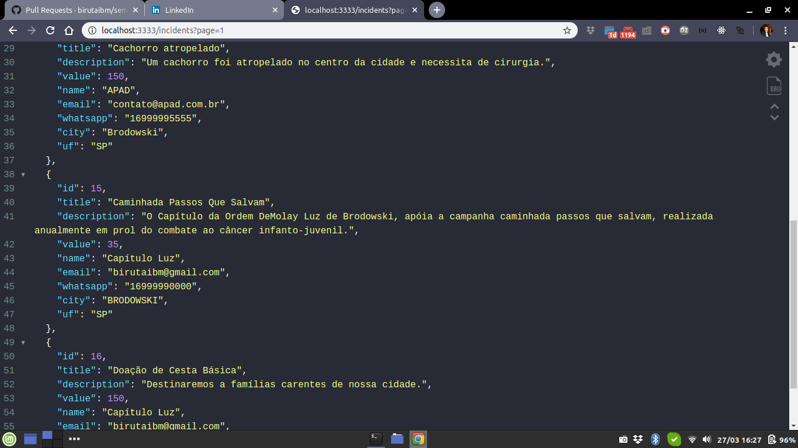
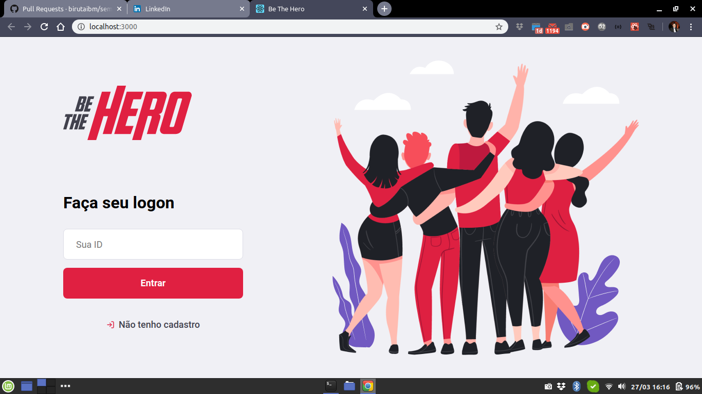
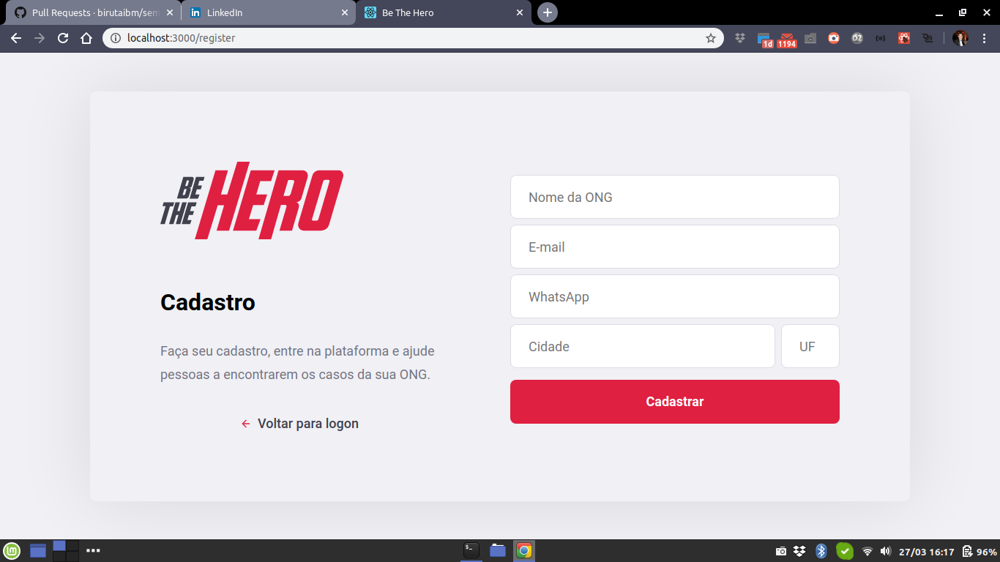
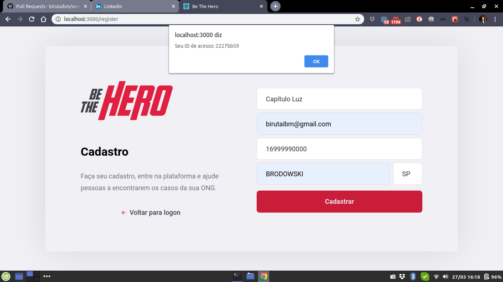
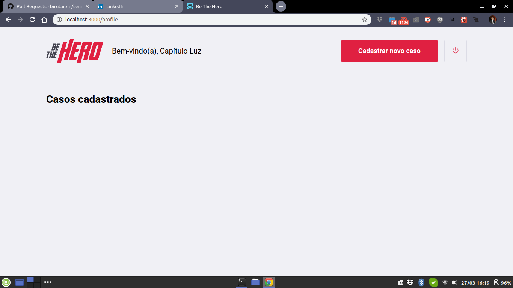
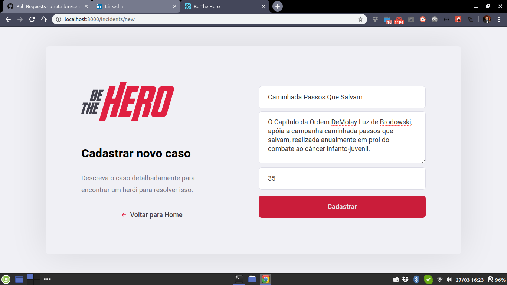
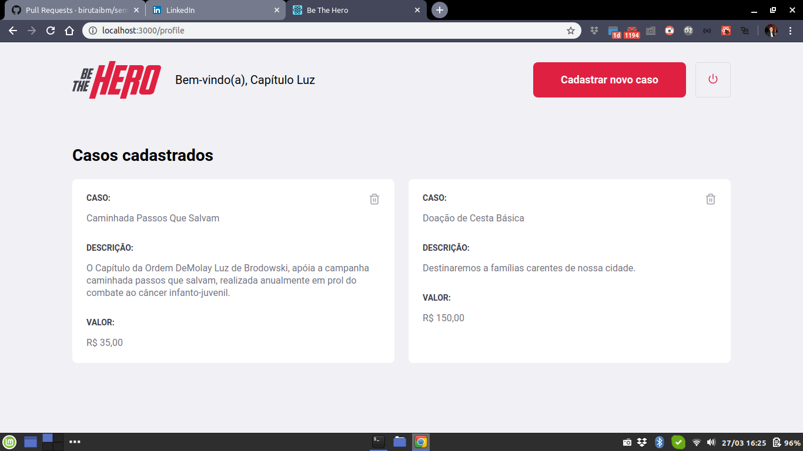

# Be The Hero

Projeto criado durante a semana 23-27/03/2020 ao longo do evento `Semana OmniStack 11` promovido pela `Rocketseat`.

Ao longo do evento pude aprender e na prática e gratuitamente as bases do desenvolvimento em `Node.js` para o back-end em `React` para a interface web e em `React Native` para a interface mobile.

Pela primeira vez no Semana OmniStack, nesta edição foi abordado banco de dados SQL utilizando o SQLite com `Knex`, testes com o `Jest` e o `Supertest` e validações com o `Celebrate`, todos no back-end. Deixo aqui meu agradecimento ao [@diego3g](https://github.com/diego3g) e a toda equipe da `Rocketseat`.

## Sobre o Projeto

A idéia do projeto é um aplicativo onde ongs se cadastrem via interface web e possam cadastrar casos ou deletar seus próprios casos. Um caso é um problema no qual a ONG precisa de doações para resolvê-lo.

Por outro lado, pessoas que acessem o aplicativo mobile podem visualizar os casos cadastrados pelas ongs e entrar em contato via e-mail ou whatsapp afim de ajudar a solucioná-lo. O aplicativo carregará automaticamente o cliente de e-mail ou o whatsApp no celular com uma mensagem padrão.

### backend

Contém toda a aplicação back-end com banco de dados SQLite e API Rest.

A figura a seguir apresenta uma rota do back-end com paginação sendo acessada diretamente do navegador:

<!-- Colocar aqui uma descrição da API com suas rotas, parâmetros e respostas -->

### web

Contém o cliente web do aplicativo voltado para o uso da ONG. Foi implementado em React utilizando axios para se comunicar com o back-end.

Veja a seguir a aparencia da home page: 

Clicando no link de "Não tenho cadastro, é a aberta a página de cadastro de ong: 

Ao preencher o formulário e clicar em "Cadastrar" é mostrado um alerta com o Id do cadastro, que será usado como login: 

Clicando "Ok" o usuário voltará para a página de login, onde usará o Id recem cadastrado para logar, acessando a página: 

Quando o usuário clicar em "Cadastrar novo caso" chegará à página  onde poderá cadastrar um novo caso.

Uma vez cadastrado(s) o(s) caso(s), aparecerá na tela da área logada como na imagem: 

### mobile

Contém o cliente mobile do aplicativo, que também utiliza axios para se comunicar com o back-end e foi feito com o expo.

## Utilização

- Primeiramente certifique-se de ter instalado em seu computador o git, o Node.js e o yarn.
- No terminal clone este repositório `git clone https://github.com/birutaibm/semana-omnistack11.git`
- Será criada a pasta "semana-omnistack11", entre nela (no linux: `cd semana-omnistack11`)
- A partir desta pasta você deverá entrar nas pastas backend, web e mobile, então abra outras abas/janelas do seu terminal e navegue cada aba para uma dessas pastas.
- Rode nas 3 pastas o comando `yarn` para instalar as dependencias de cada projetos.
- Na pasta do backend rode `yarn dev` isso executará o backend que ficará ouvino na porta 3333
- Na pasta web rode `yarn start` isso abrirá a interface web no seu navegador
- Para a interface mobile, rode `yarn android` ou `yarn ios` de acordo com seu dispositivo, então abra o expo no dispositivo e escaneie o QRCode que foi exibido no terminal.

Obviamente seguir esses passos irá rodar o projeto apenas localmente, para colocá-lo de fato no ar você precisará de um servidor.
